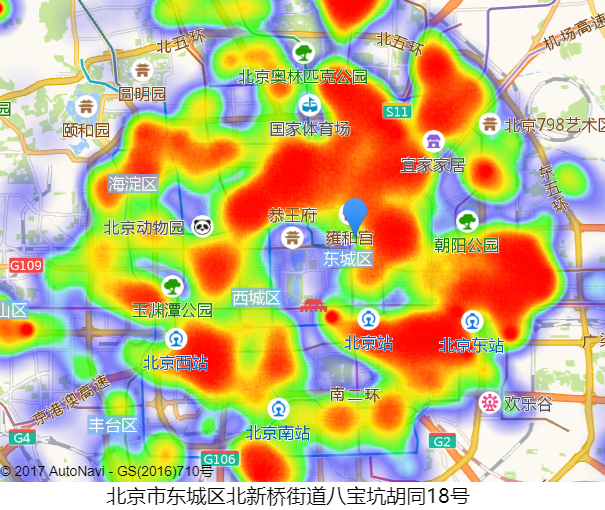

# house_analysis

## 项目介绍
一个对北京地区租房情况进行可视化分析的web_app(未完成，只完成初版，可进行热力图可视化)




## 项目依赖
````
  1. mongoDB
````

## 安装&运行
先安装上述服务，否则无法运行
````
安装:npm install

/house_web:
运行:npm start

/house
运行：node index
(需要根据需求修改index文件)

````


## 后端内容:/house

 
 ###2017.11.23
 - [X] 用node+express+mongoDB做出爬虫初版(对链家网房源信息爬取)
 - [x] 代码用async，await重写，美化代码
 - [x] 用aysnc，eventproxy做出流量控制
 - [x] mongoDB存取数据，同时用高德api对所有地址做出解析
 
 待完成：
 - [ ] 用mysql对数据库进行重构
 - [ ] 用命令行运行的方式对项目做到自动化操作（数据更新，数据分析，增加数据）
 
 

## 前端内容：/house_web

### 2017.11.23
 - [x] 调用高德js api热力图模块，对数据进行热力图可视化
 - [x] 支持房屋数量的可视化
 
 待完成
 
 - [ ] 支持房屋单价，总价的直观体现
 - [ ] 对数据进行单点处理，能直观的看到各个区域租房详细信息(价位，图片)
 
 
 
 
  


前端项目运行于：[http://localhost:3000](http://localhost:3000)
后端服务器运行于：[http://localhost:8000](http://localhost:8000)

## 技术栈
- 后端 : express+node
- 前端 :react